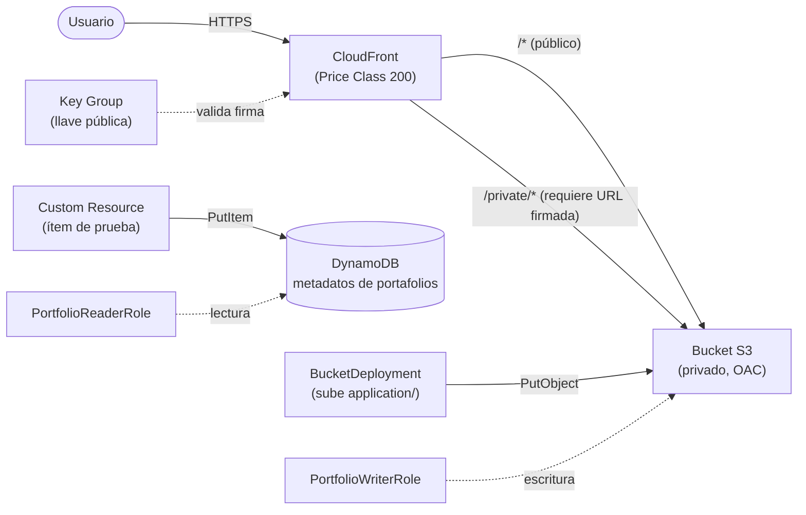

# Arquitectura — Plataforma de Portafolios Estudiantiles

Plataforma estática para portafolios de estudiantes de la Universidad del Valle, definida con AWS CDK (TypeScript) y desplegable con un solo `cdk deploy`.

---

## 1. Diagrama de arquitectura

---

## 2. Componentes

| Componente | Servicio AWS | Responsabilidad | Decisiones de diseño |
|---|---|---|---|
| Almacenamiento | S3 | Guarda los archivos estáticos del portafolio (HTML, CSS, imágenes) y los archivos privados bajo `private/`. | Bucket **privado** con `BLOCK_ALL`. Con `removalPolicy: DESTROY` y `autoDeleteObjects: true` para que `cdk destroy` pueda borrarlo aunque tenga contenido. |
| CDN | CloudFront | Único punto de entrada: sirve el contenido con caché cerca del usuario y fuerza HTTPS. | Accede al bucket con **Origin Access Control (OAC)**. `defaultRootObject: index.html`, redirección HTTP → HTTPS y **Price Class 200**. |
| Metadatos | DynamoDB | Registra estudiante, fecha, URL y visibilidad de cada portafolio. | Clave de partición `studentId` (único e inmutable por portafolio). `PAY_PER_REQUEST`: se paga solo por uso, sin capacidad reservada. Con `removalPolicy: DESTROY`. |
| Permisos | IAM | Define quién puede escribir en S3 y quién puede leer en DynamoDB. | Dos roles separados, con permisos generados por `grantWrite` y `grantReadData` para que apliquen solo a este bucket y a esta tabla. |

### Roles IAM

| Rol | Puede | No puede |
|---|---|---|
| `PortfolioWriterRole` | Escribir y borrar objetos en el bucket del portafolio. | Leer objetos ni tocar DynamoDB. |
| `PortfolioReaderRole` | Leer la tabla (`GetItem`, `Query`, `Scan`, `BatchGetItem`). | Escribir en la tabla ni acceder al bucket. |

Los roles pueden ser asumidos por identidades de la propia cuenta (`AccountRootPrincipal`), que además tengan permiso para asumirlos.

---

## 3. Seguridad y acceso

**Bucket no accesible directamente.** El bucket tiene bloqueado todo acceso público (`BlockPublicAccess.BLOCK_ALL`). Una petición directa a `https://<bucket>.s3.us-east-2.amazonaws.com/index.html` devuelve **403 Forbidden**.

**Acceso de CloudFront al bucket privado.** CloudFront usa **Origin Access Control (OAC)**. CDK agrega a la política del bucket una declaración que permite `s3:GetObject` al servicio `cloudfront.amazonaws.com` únicamente cuando la petición viene de **esta distribución** (condición `AWS:SourceArn`). Ninguna otra identidad puede leer los objetos por esa vía.

**Permisos mínimos.** Cada rol tiene solo las acciones que necesita y limitadas a un recurso concreto (el bucket o la tabla del stack). Las Lambdas auxiliares que CDK crea por detrás (subida de archivos, autodelete e ítem de prueba) tienen cada una su propio rol con permisos acotados; por ejemplo, la del ítem de prueba solo puede hacer `dynamodb:PutItem` sobre la tabla.

---

## 4. Flujo de despliegue

- Lenguaje elegido para CDK: `TypeScript`
- Región: `us-east-2` · Stack: `CdkStack`
- Preparación (una sola vez por cuenta y región): `cdk bootstrap`
- Validar la plantilla: `cdk synth`
- Desplegar: `cdk deploy`
- Destruir: `cdk destroy`

Un solo `cdk deploy` crea el bucket, la distribución, la tabla, los roles, **sube los archivos de `application/` al bucket** (`BucketDeployment`, que además invalida la caché de CloudFront) y **carga el ítem de prueba** en DynamoDB (custom resource). Al terminar imprime como outputs el dominio de CloudFront y el `KeyPairId`.

### Pruebas realizadas

| # | Prueba | Resultado |
|---|---|---|
| 1 | `GET /` por CloudFront (público) | `200`; el servidor de borde guardó el objeto en caché (`x-cache: Hit from cloudfront` en la segunda petición). |
| 2 | Acceso directo al bucket S3 | `403 Forbidden`. |
| 3 | Ítem de prueba en DynamoDB | Existe un ítem con `studentId` `univalle-2026-001` y su `url` apuntando al dominio real de CloudFront. |
| 4 | `GET /private/secreto.html` sin firma | `403`, respondido por CloudFront. |
| 5 | `GET /private/secreto.html` con URL firmada | `200`. |
| 6 | `GET /` público después de agregar lo privado | Sigue en `200`: no se rompió lo existente. |

---

## 5. Boss Fight

**Archivos privados (URLs firmadas).** Se usan **CloudFront Signed URLs**. Se generó un par de llaves RSA: la **llave pública** se registra en CloudFront (recurso `PublicKey` y `KeyGroup`, definidos en el stack) y la **llave privada** se guarda fuera del repositorio y nunca se sube a git. Las URLs firmadas se generan con `aws cloudfront sign` y tienen fecha de caducidad.

**Convivencia de archivos públicos y privados.** Una sola distribución con dos comportamientos sobre el mismo bucket:

| Ruta | Acceso |
|---|---|
| `/*` (comportamiento por defecto) | Público, sin firma. |
| `/private/*` | Requiere URL firmada (`trustedKeyGroups`). |

Así el contenido público existente no cambió, y lo privado se separa por ruta dentro del mismo bucket.

**Price Class.** Se configuró `PRICE_CLASS_200`, que según la documentación de CloudFront cubre Norteamérica, Europa y Asia (entre otras regiones), pero deja fuera los servidores de borde más caros. Es la clase que pide el requisito para servir a América Latina, Europa y Asia a menor costo.

**Trade-off observado.** Antes del cambio, las peticiones desde Colombia las atendía un servidor de borde de Bogotá (`BOG51`). Con Price Class 200, pasaron a atenderse desde Miami (`MIA50`). Es decir, se reduce el costo, pero un usuario en Sudamérica puede tener algo más de latencia que con la clase por defecto. Para la Universidad del Valle conviene considerarlo si la mayoría de los visitantes están en Colombia.

---

## 6. Cleanup

Al terminar se ejecuta `cdk destroy`. El bucket se vacía automáticamente (`autoDeleteObjects`) y el resto de los recursos se eliminan por `removalPolicy: DESTROY`. El entorno de `cdk bootstrap` es independiente del stack y puede quedarse en la cuenta.